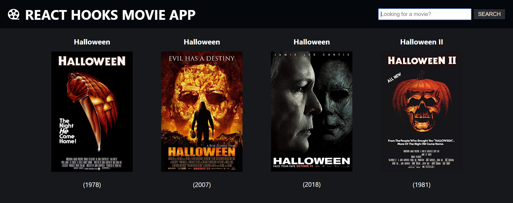

# Movie App build with React Hooks

Project from the article [here](https://www.freecodecamp.org/news/how-to-build-a-movie-search-app-using-react-hooks-24eb72ddfaf7/)



# Installing

How to run this project:

- Create a folder and navigate into it

```
cd <folder-name>
```

- Clone this repository:

```
git clone https://github.com/mariav53/react-hooks-movie-app
```

- Install the project's dependencies:

```
yarn or npm install
```

- run the project:

```
npm start or yarn start
```
